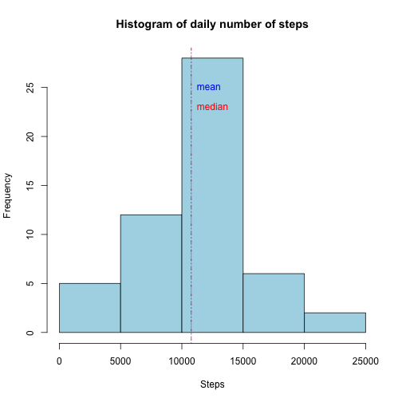
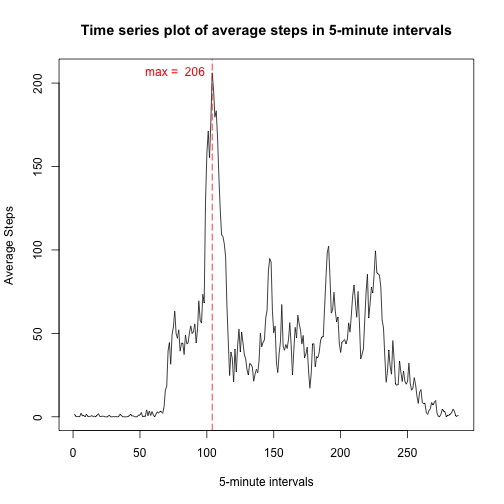
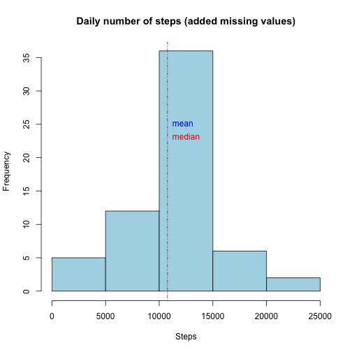
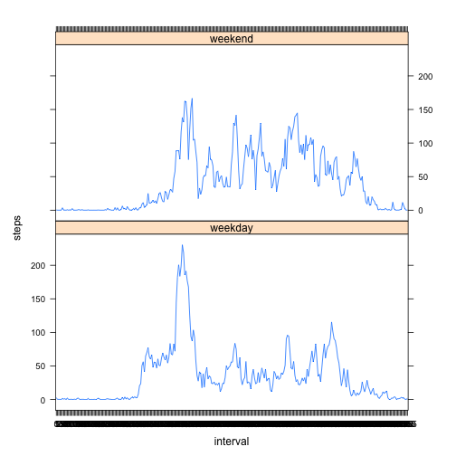

# Reproducible Research - Peer assessment 1

It is now possible to collect a large amount of data about personal movement using activity monitoring devices such as a Fitbit, Nike Fuelband, or Jawbone Up. These type of devices are part of the “quantified self” movement – a group of enthusiasts who take measurements about themselves regularly to improve their health, or to find patterns in their behavior.

Data source: See <https://github.com/rdpeng/RepData_PeerAssessment1>. This assignment makes use of data from a personal activity monitoring device. This device collects data at 5 minute intervals through out the day. The data consists of two months of data from an anonymous individual collected during the months of October and November, 2012 and include the number of steps taken in 5 minute intervals each day.

## Loading and preprocessing the data


```r
AllData <- read.csv("activity.csv")
```


## What is mean total number of steps taken per day?

Calculate the total number of steps taken per day. Make a histogram of the total number of steps taken each day.


```r
df_all <- as.data.frame(AllData)
df <- df_all[complete.cases(df_all),]
stepsPerDay <- split(df, df$date, drop = TRUE)
SumStepsPerDay <- sapply(stepsPerDay, function(x) sum(x$steps))
hist(SumStepsPerDay, main="Histogram of daily number of steps", xlab="Steps", col="lightblue")
abline(v=mean(SumStepsPerDay), lty=3, col="blue")  # Line indicating the mean  
abline(v=median(SumStepsPerDay), lty=4, col="red") # Line indicating the median  
text(mean(SumStepsPerDay),25,labels="mean", pos=4, col="blue")
text(mean(SumStepsPerDay),23,labels="median", pos=4, col="red")
```

 

The **Mean** and **median** of the total number of steps taken per day is reported in the table below.


```r
summary(SumStepsPerDay)
```

```
##    Min. 1st Qu.  Median    Mean 3rd Qu.    Max. 
##      41    8841   10760   10770   13290   21190
```

## What is the average daily activity pattern?
Time series plot (i.e. type = "l") of the 5-minute interval (x-axis) and the average number of steps taken, averaged across all days (y-axis).


```r
splitPerInterval <- split(df, df$interval, drop = TRUE)
meanStepsPerInterval <- sapply(splitPerInterval, function(x) mean(x$steps))

plot(meanStepsPerInterval,
     type="l",
     main="Time series plot of average steps in 5-minute intervals",
     xlab = "5-minute intervals", ylab = "Average Steps")
abline(v=which.max(meanStepsPerInterval), lty=5, col="red")
text(which.max(meanStepsPerInterval),
     max(meanStepsPerInterval),  
     labels=paste("max = ",as.character(round(max(meanStepsPerInterval)))), 
     pos=2, col="red")    
```

 

Which 5-minute interval, on average across all the days in the dataset, contains the maximum number of steps?

First, the **interval** containing the maximum number of steps is interval 104, computed below:

```r
which.max(meanStepsPerInterval) #giving the index of the first maximum of x: 104
```

```
## 835 
## 104
```
Second, the maximum number of steps is 206, as computed below:

```r
max(meanStepsPerInterval) #max average steps
```

```
## [1] 206.1698
```

## Imputing missing values

The presence of missing days may introduce bias into some calculations or summaries of the data.

Calculate and report the total number of missing values in the dataset, i.e. the **total number of rows with NAs** is **2304**:


```r
nrow(df_all[!complete.cases(df_all),]) #number of rows with NA
```

```
## [1] 2304
```

Let's use a strategy for filling in all of the missing values in the dataset. The strategy is not sophisticated, here I use the mean for 5-minute interval:


```r
df_padded <- df_all
# convert interval(s) to factor(s)
df_padded$interval <- factor(df_padded$interval)
zz <- factor(meanStepsPerInterval)
#mean for that 5-minute interval for missing values
df_padded$steps[is.na(df_padded$steps)] <- meanStepsPerInterval[df_padded$interval]
```

```
## Warning in df_padded$steps[is.na(df_padded$steps)] <-
## meanStepsPerInterval[df_padded$interval]: number of items to replace is
## not a multiple of replacement length
```
A new dataset that is equal to the original dataset but with the missing data filled in was created, **df_padded**.After padding the missing steps, we can observe that there are no incomplete rows:


```r
nrow(df_padded[!complete.cases(df_padded),])
```

```
## [1] 0
```

Histogram of the total number of steps taken each day, when missing values have been inputed:


```r
stepsPerDay2 <- split(df_padded, df_padded$date, drop = TRUE)
SumStepsPerDay2 <- sapply(stepsPerDay2, function(x) sum(x$steps))
hist(SumStepsPerDay2, main="Daily number of steps (added missing values)", xlab="Steps", col="lightblue")
abline(v=mean(SumStepsPerDay2), lty=3, col="blue") # Line indicating the mean  
abline(v=median(SumStepsPerDay2), lty=4, col="red") # Line indicating the median  
text(mean(SumStepsPerDay2),25,labels="mean", pos=4, col="blue")
text(mean(SumStepsPerDay2),23,labels="median", pos=4, col="red")
```

 

The **NEW** **Mean** and **median** of the total number of steps taken per day is reported in the table below, when missing values have been inputed:


```r
summary(SumStepsPerDay2)
```

```
##    Min. 1st Qu.  Median    Mean 3rd Qu.    Max. 
##      41    9819   10770   10770   12810   21190
```

The **PREVIOUS** **mean** and **median** of the total number of steps taken per day is reported in the table below, when missing values had **NOT** been inputed:

```r
summary(SumStepsPerDay)
```

```
##    Min. 1st Qu.  Median    Mean 3rd Qu.    Max. 
##      41    8841   10760   10770   13290   21190
```


Do these values differ from the estimates from the first part of the assignment? What is the impact of imputing missing data on the estimates of the total daily number of steps?

**Yes**, the values differ between the two parts of the assignment. The quartiles vary between 5% and 10%, the mean increased, but the median total number of steps per day is exactly the same. The outcome of the analysis was impacted by inputting mean values for the incomplete (NA) cases, and depending on the strategy that is used, the impact could be greater or lesser.

## Are there differences in activity patterns between weekdays and weekends?

Using the dataset with the filled-in missing values, create a new factor variable in the dataset with two levels – “weekday” and “weekend” indicating whether a given date is a weekday or weekend day.


```r
df_padded$day = ifelse(as.POSIXlt(as.Date(df_padded$date))$wday%%6 == 
                                    0, "weekend", "weekday")
# For Sunday and Saturday : weekend, Other days : weekday
df_padded$day = factor(df_padded$day, levels = c("weekday", "weekend"))
```

As shown below, a new factor `day` column is added to the padded dataset:

```r
str(df_padded)
```

```
## 'data.frame':	17568 obs. of  4 variables:
##  $ steps   : num  1.717 0.3396 0.1321 0.1509 0.0755 ...
##  $ date    : Factor w/ 61 levels "2012-10-01","2012-10-02",..: 1 1 1 1 1 1 1 1 1 1 ...
##  $ interval: Factor w/ 288 levels "0","5","10","15",..: 1 2 3 4 5 6 7 8 9 10 ...
##  $ day     : Factor w/ 2 levels "weekday","weekend": 1 1 1 1 1 1 1 1 1 1 ...
```

Panel plot containing a time series plot (i.e. `type = "l"`) of the 5-minute interval (x-axis) and the average number of steps taken, averaged across all weekday days or weekend days (y-axis):


```r
stepsPerDay = aggregate(steps ~ interval + day, df_padded, mean)
library(lattice)
xyplot(steps ~ interval | factor(day), data = stepsPerDay, aspect = 1/2, 
       type = "l")
```

 

What we observe from the plots is that during a weekday, the mean steps are mostly generated early in the day and late in the day. Whereas during the weekend, the mean steps are generated throughout the day.


